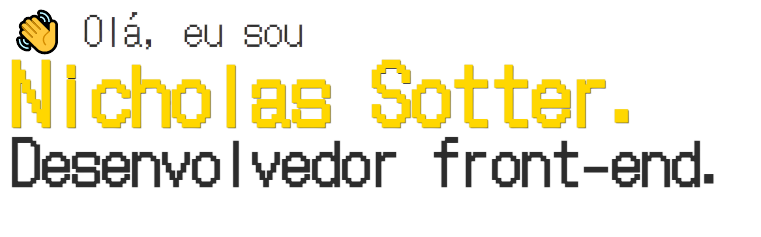

<h1>🟨 Portfólio Front-end</h1>

<h2>🟨 Sobre o projeto </h2>

Site para me apresentar e mostrar meus futuros projetos. 
Utilizei HTML, CSS e JS puros, na parte do HTML formatei o texto de forma que seja possivel navegar por <code>tab</code> ou pelo navbar fixo ao topo, fiz uma estilização compacta, organizada
de fácil visualização.
O site possui modo escuro, menu mobile, responsividade, animações e interações CSS.

